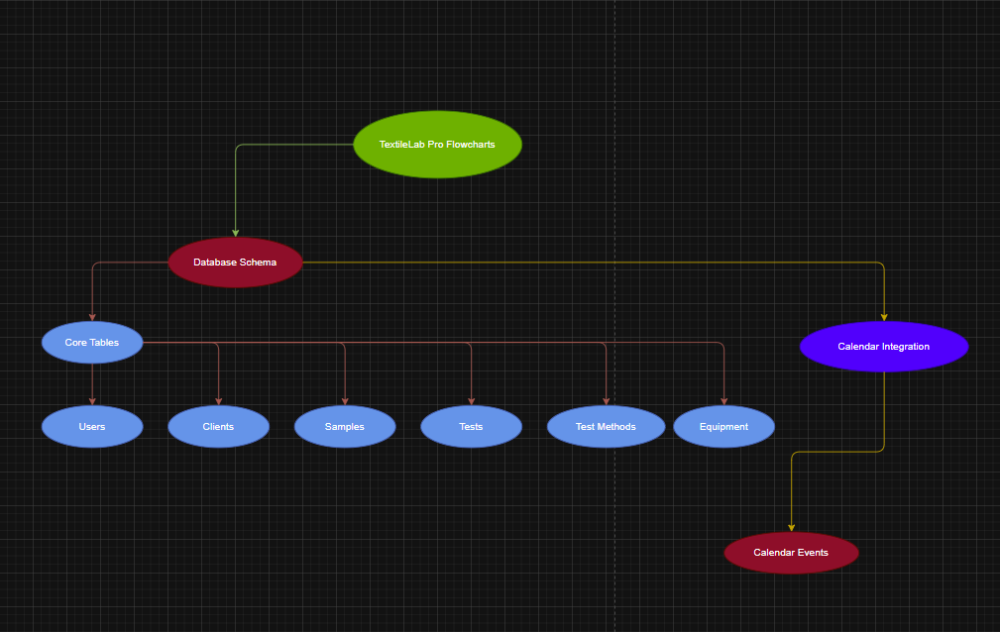

# TextileLab Pro System Architecture

## Database Schema

The database schema shows the core relationships between:
- Users and their roles (Admin, Technician, Manager, Client)
- Samples and their associated tests
- Equipment and maintenance records
- Calendar integration for scheduling

## Core Workflows

### 1. Sample Management
- Sample submission and registration
- Test scheduling and assignment
- Results recording and reporting
- Client notification

### 2. Equipment Management
- Regular maintenance scheduling
- Calibration tracking
- Status monitoring
- Resource allocation

### 3. User Access Control
- Role-based authentication
- Permission management
- Dashboard access
- Session handling

### 4. Calendar System
- Test scheduling
- Equipment maintenance booking
- Client appointments
- Resource conflict management

## Next Steps

### 1. Frontend Development
- [ ] Complete dashboard layouts
- [ ] Implement test management interface
- [ ] Build equipment tracking views
- [ ] Create reporting interface

### 2. Backend Implementation
- [ ] Set up API routes
- [ ] Implement database operations
- [ ] Add authentication middleware
- [ ] Create test result processing

### 3. Testing & Quality Assurance
- [ ] Unit tests for core functions
- [ ] Integration tests for workflows
- [ ] User acceptance testing
- [ ] Security testing

### 4. Documentation
- [ ] API documentation
- [ ] User guides
- [ ] System administration guide
- [ ] Deployment instructions

Would you like to focus on implementing any specific component?
