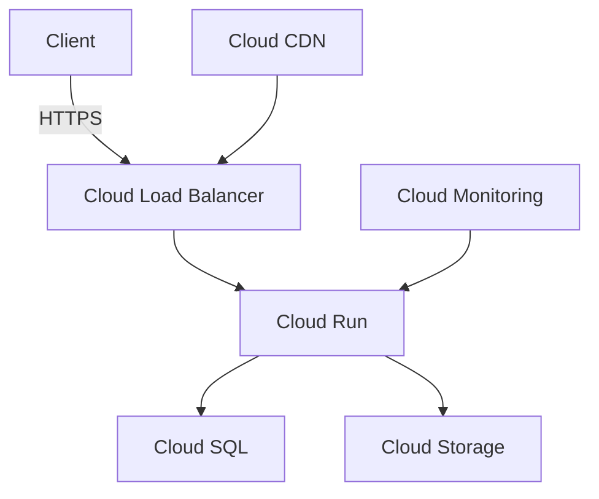

# Google Cloud Platform Deployment Strategy

## Recommended GCP Services

### 1. Application Hosting
- **Cloud Run**
  - Serverless container platform
  - Auto-scaling capabilities
  - Pay-per-use pricing
  - Supports Next.js applications
  - Easy deployment with Docker

### 2. Database Options
- **Cloud SQL for PostgreSQL**
  - Fully managed PostgreSQL
  - Automatic backups
  - High availability
  - Built-in replication
  - Easy scaling

### 3. File Storage
- **Cloud Storage**
  - Object storage for files and reports
  - Highly durable and available
  - CDN integration
  - Lifecycle management

### 4. Additional Services
- **Cloud Load Balancing**
  - Global load distribution
  - SSL/TLS termination
  - Auto-scaling support

- **Cloud CDN**
  - Global content delivery
  - Edge caching
  - Reduced latency

- **Cloud Monitoring**
  - Performance monitoring
  - Logging
  - Error tracking
  - Custom dashboards

## Deployment Architecture



## Cost Optimization

### 1. Cloud Run
- Pay only for actual usage
- Auto-scales to zero when inactive
- Estimated cost: $20-50/month

### 2. Cloud SQL
- Start with smaller instance
- Scale up as needed
- Estimated cost: $30-100/month

### 3. Cloud Storage
- Pay for what you use
- Lifecycle policies for cost optimization
- Estimated cost: $5-20/month

## Deployment Steps

### 1. Initial Setup
```bash
# Install Google Cloud SDK
# Initialize project
gcloud init

# Set project ID
gcloud config set project [YOUR_PROJECT_ID]

# Enable required services
gcloud services enable \
  run.googleapis.com \
  sql-component.googleapis.com \
  sqladmin.googleapis.com \
  storage.googleapis.com \
  monitoring.googleapis.com
```

### 2. Database Setup
```bash
# Create Cloud SQL instance
gcloud sql instances create textile-lab-db \
  --database-version=POSTGRES_14 \
  --cpu=2 \
  --memory=4GB \
  --region=asia-southeast1

# Create database
gcloud sql databases create textilelab \
  --instance=textile-lab-db
```

### 3. Storage Setup
```bash
# Create storage bucket
gcloud storage buckets create gs://textile-lab-storage \
  --location=asia-southeast1 \
  --default-storage-class=STANDARD
```

### 4. Application Deployment
```bash
# Build Docker image
docker build -t gcr.io/[PROJECT_ID]/textile-lab .

# Push to Container Registry
docker push gcr.io/[PROJECT_ID]/textile-lab

# Deploy to Cloud Run
gcloud run deploy textile-lab \
  --image gcr.io/[PROJECT_ID]/textile-lab \
  --platform managed \
  --region asia-southeast1 \
  --allow-unauthenticated
```

## Environment Variables
```env
# Database
DATABASE_URL=postgresql://user:password@/textilelab?host=/cloudsql/[PROJECT_ID]:asia-southeast1:textile-lab-db
DIRECT_URL=postgresql://user:password@[PRIVATE_IP]/textilelab

# Storage
GOOGLE_STORAGE_BUCKET=textile-lab-storage

# Application
NEXT_PUBLIC_APP_URL=https://[YOUR_DOMAIN]
NEXTAUTH_URL=https://[YOUR_DOMAIN]
NEXTAUTH_SECRET=[GENERATED_SECRET]
```

## Security Considerations

### 1. IAM Setup
- Create service accounts
- Set minimal required permissions
- Use workload identity

### 2. Network Security
- Configure VPC
- Set up Cloud Armor
- Enable Cloud IAP if needed

### 3. Data Security
- Enable Cloud SQL encryption
- Set up backup policies
- Configure audit logging

## Monitoring Setup

### 1. Cloud Monitoring
- Set up uptime checks
- Configure alerts
- Create dashboards

### 2. Logging
- Enable Cloud Logging
- Set up log exports
- Configure error reporting

## Next Steps

1. **Initial Setup**
   - [ ] Create GCP project
   - [ ] Enable required APIs
   - [ ] Set up IAM roles

2. **Infrastructure**
   - [ ] Deploy Cloud SQL
   - [ ] Create storage buckets
   - [ ] Configure networking

3. **Application**
   - [ ] Create Dockerfile
   - [ ] Set up CI/CD
   - [ ] Deploy to Cloud Run

4. **Monitoring**
   - [ ] Set up monitoring
   - [ ] Configure alerts
   - [ ] Create dashboards

Would you like to proceed with any of these steps?
