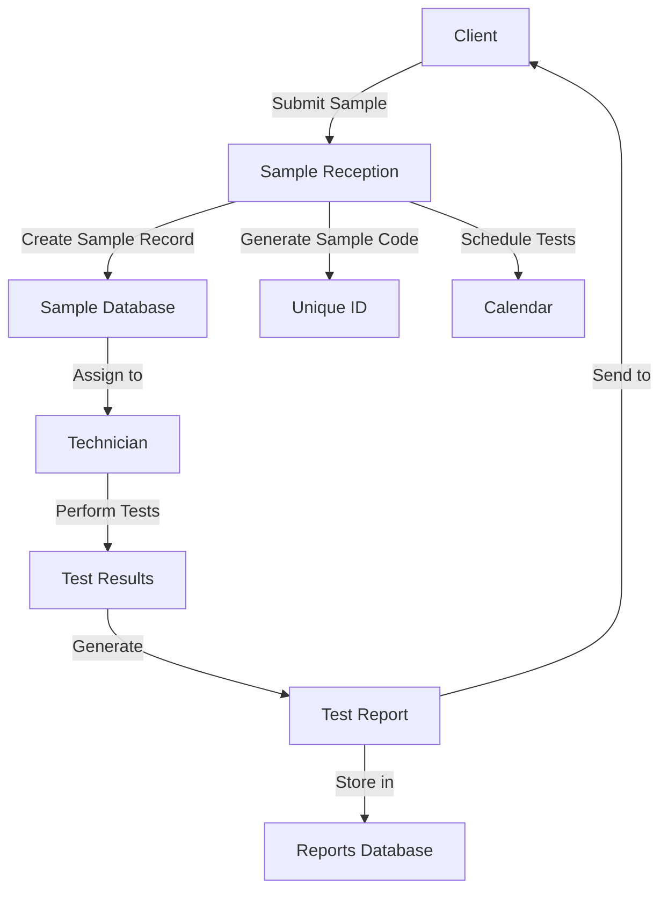
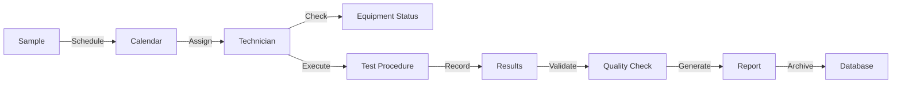
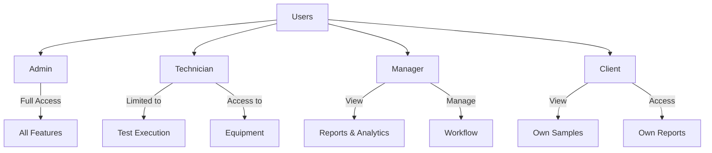
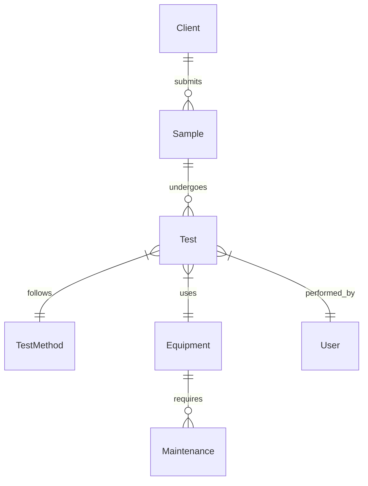
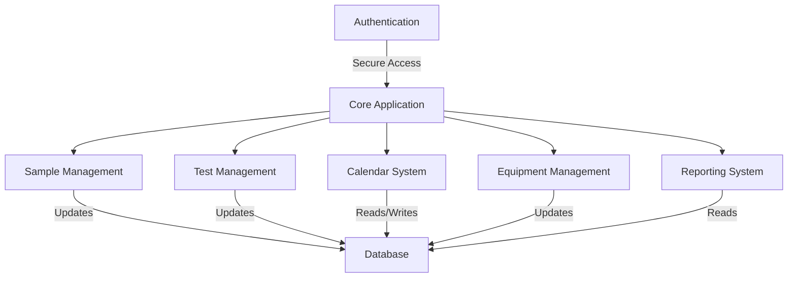
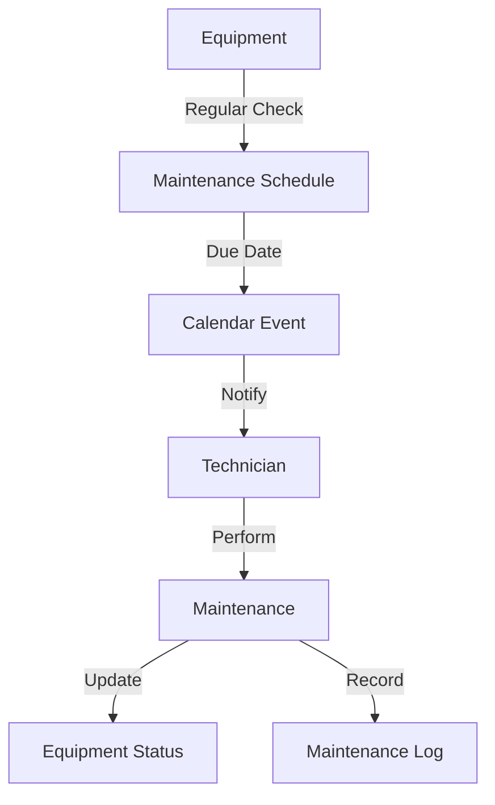
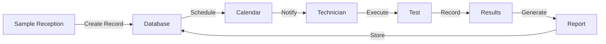

# TextileLab Pro Workflow Documentation

## Core Workflows

### 1. Sample Management Flow

### 2. Test Process Flow

### 3. User Roles and Permissions

## System Components

### 1. Database Schema Relationships

### 2. Module Integration

## Key Processes

### 1. Sample Submission Process
1. Client submits sample
2. Reception creates sample record
3. System generates unique sample code
4. Tests are scheduled
5. Notifications sent to relevant personnel

### 2. Test Execution Process
1. Technician receives test assignment
2. Equipment status verified
3. Test procedures executed
4. Results recorded
5. Quality check performed
6. Report generated

### 3. Report Generation Process
1. Test results compiled
2. Data validated
3. Report template populated
4. Quality check performed
5. Report approved
6. Client notified
7. Report archived

## Calendar Integration

### 1. Event Types
- Test Scheduling
- Equipment Maintenance
- Client Meetings
- Quality Checks
- Training Sessions

### 2. Calendar Features
- Resource allocation
- Conflict detection
- Automated scheduling
- Notification system
- Integration with test workflow

## Equipment Management

### 1. Maintenance Workflow

## Data Flow

### 1. Sample Testing Flow

## Integration Points

### 1. External Systems
- Client Portal
- Equipment API
- Reporting Tools
- Notification System
- Analytics Platform

### 2. Internal Systems
- Authentication
- Database
- File Storage
- Task Queue
- Backup System

## Future Enhancements

### 1. Planned Features
- Mobile Application
- Advanced Analytics
- Machine Learning Integration
- Automated Quality Control
- Extended API Support

### 2. Integration Opportunities
- ERP Systems
- Quality Management Systems
- Customer Relationship Management
- Supply Chain Management
- Business Intelligence Tools
